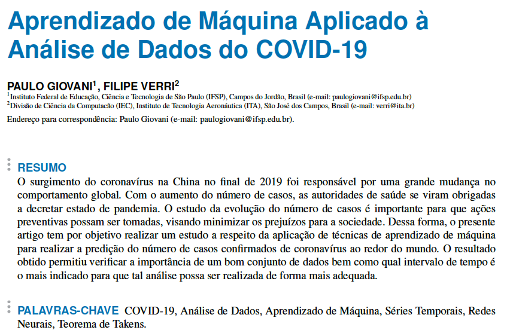

# Relatório Final POO-233
Esse repositório contém os arquivos que desenvolvi durante o período em que cursei como aluno ouvinte a disciplina de POO-233: Machine Learning, ministrada pelo Prof. Filipe Verri, no Instituto Tecnológico de Aeronáutica (ITA), em 2020.

## Requisitos

Todos os códigos foram desenvolvidos em linguagem python, em conjunto com as seguintes bibliotecas: wget, ssl, jupyter lab, pandas, numpy, matplotlib, seaborn, statistics, scipy, prettytable, tensorflow, scikit-learn e keras.

## Arquivos

* **01_preparacao_dados**: *notebook com download e preparação dos dados que foram utilizados no trabalho*;
* **02_analise_exploratoria**: *notebook com os passos realizados para a análise exploratória do conjunto de dados*;
* **03_pre_processamento_inicio**: *notebook com os passos da etapa de pré-processamento dos dados*;
* **04_pre_processamento_final**: *notebook com os passos da etapa de pré-procesamento dos dados*;
* **05_aplicacao_LSTM**: *notebook com a aplicação do algoritmo de aprendizado de máquina*;
* **data**: *diretório com os arquivos de dados utilizados no trabalho*;
* **html**: *diretório com os notebooks gravados em formato html*;
* **imagens**: *imagens que foram geradas durante a execução dos notebooks*;
* **latex**: *arquivos do artigo, em formato TEX*;
* **artigo_final_Paulo**: *artigo gerado para a disciplina, em formato PDF*.

